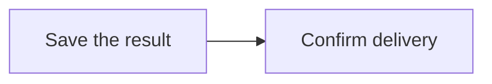

# Diagrams in artifacts

Artifacts render fenced `mermaid` blocks as diagrams in the reader and editor
preview, both locally and in the paired mobile app. For example:

````markdown

````

Diagrams retain their natural size in a scrollable panel. **Expand diagram** opens
a larger viewer with zoom, Fit, and actual-size (100%) controls. Escape closes the viewer and returns
focus to the Expand button. **Mermaid source** reveals the original text; malformed
diagrams show it automatically. Editing and Markdown export preserve that source.

The renderer is bundled locally, loaded only for documents containing Mermaid,
and renders diagrams as they approach the viewport. It uses strict security mode,
SVG text labels, and bounded source/edge counts. Diagram styles follow the system
light/dark appearance. It does not load a CDN or enable diagram links/callbacks.

To verify the production native and paired-mobile UI, build the mobile app and
CLI, run `node tools/serve_artifact_diagrams_fixture.mjs`, then use Playwright CLI
to open each fixture URL and run `tools/artifact_diagrams_browser_checks.js`.
The fixture uses an isolated database and removes it when stopped.
